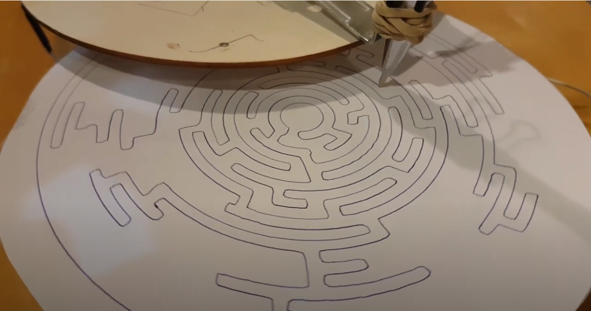

# polarwriter

A simple plotter consisting of two stepper-driven discs. Controlled by an Arduino and Motor Shield V2.
Individual coordinates are fed live through TouchDesigner which also vectorizes the original input.
A servo with a spring-modified pen is attached to allow for separate lines.

